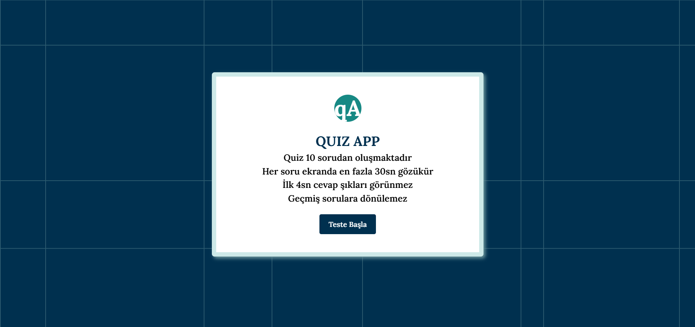
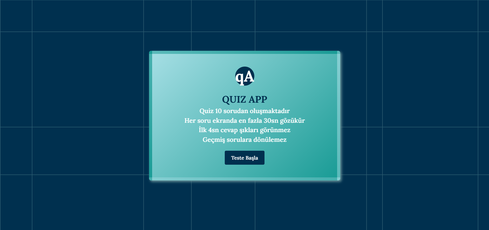
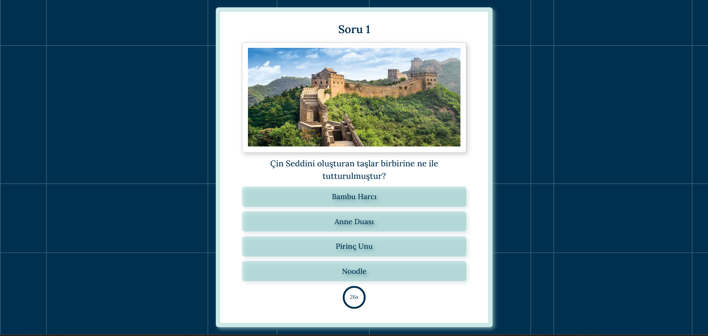
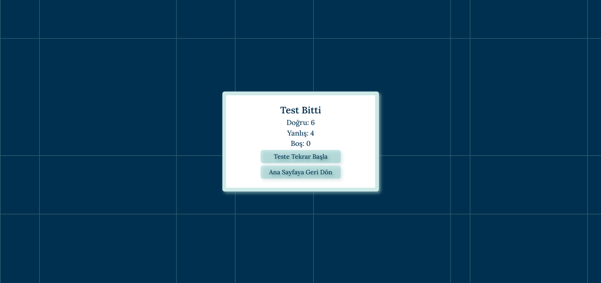
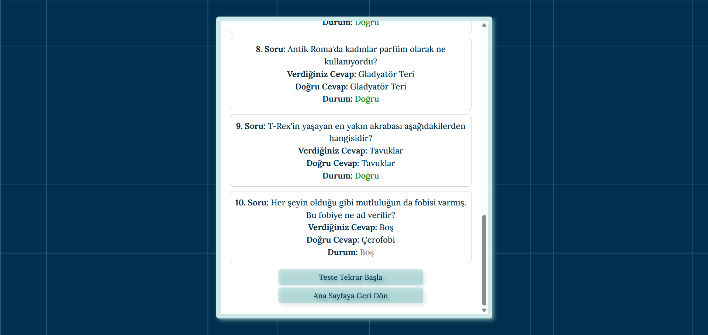

# 📚 Quiz Uygulaması (React + Vite)
Bu proje, React ve Vite kullanılarak geliştirilmiş zaman sınırlı, görselli ve eğlenceli bir quiz (test) uygulamasıdır. Uygulama, kullanıcıların 10 farklı soruya görsellerle birlikte cevap vermesini sağlar. Her soruya maksimum 30 saniye süre tanınır. Ayrıca animasyonlu geçiş efektleri ve yuvarlak bir zamanlayıcı gösterimi içerir.

# 🚀 Özellikler
⏱️ Her soruya 30 saniyelik cevap süresi

🕒 İlk 4 saniye boyunca şıklar gizli kalır

🎬 Her soru arası geçişte fade-in animasyonu

📸 Sorular görsellerle birlikte gelir

✅ Cevap sonrası otomatik olarak bir sonraki soruya geçiş

🚫 Önceki sorulara dönüş yok

🔁 Test bitiminde tekrar başlatma ve ana sayfaya dönüş

📊 Test sonucu: Doğru, Yanlış, Boş sayısı

🎯 Dairesel (yuvarlak) animasyonlu sayaç göstergesi

# Canlı Proje Linki
[Questionapp](https://questionnapp.netlify.app/)

# Proje Görselleri 

